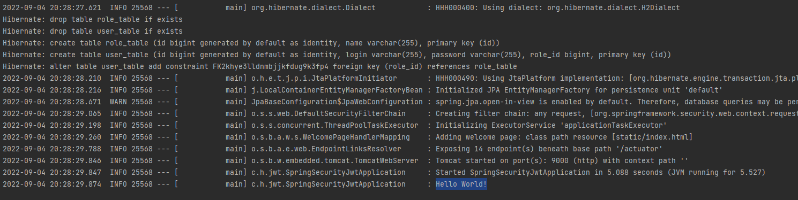
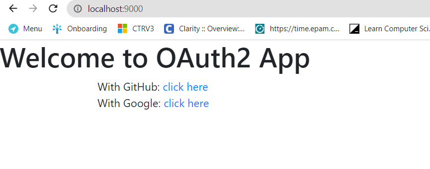
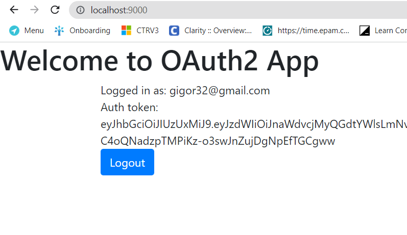

# Spring-boot project
Spring-boot project is a Java project for learning:  <br/>
Spring Boot, Spring Data, Spring Security(OAuth2, JWT), Health indicators, Flyway.

## Tools
Before proceeding, install a [JDK](https://docs.oracle.com/javase/8/docs/technotes/guides/install/install_overview.html)
(must be Java 8 or later). <br/>
Also, you may need to download [Docker](https://docs.docker.com/get-docker/) to see Prometheus metrics

## Run application
### Task 1:
- Start application.
- You will see last message int terminal "Hello World!" like in example below.<br/>  

### Task 2:
- This app supports CRUD operation in process of user creation(see next tasks)

### Task 3:
To see usage of OAuth2:
- Start application
- Go to http://localhost:9000/ (dev env by default), and chose GitHub or Google to login in 
- If operation completed success, you will see following window ->  

You can find usage of JWT Token, after success login, from previous step.
<br/> Or you can send following requests
- Register new user.<br/> 
  ```
  curl --location --request POST 'localhost:9000/register' \
  --header 'Content-Type: application/json' \
  --header 'Cookie: JSESSIONID=68CB88415E1E9276BF5EBFA4D23912BF; XSRF-TOKEN=5c88183f-a093-477e-9db2-c4c821996b60' \
  --data-raw '{
  "login": "test",
  "password": "test",
  "role": "ROLE_ADMIN"
  }'
  ```
- Authenticate in to the app
   ```
   curl --location --request POST 'localhost:9000/auth' \
   --header 'Content-Type: application/json' \
   --header 'Cookie: JSESSIONID=68CB88415E1E9276BF5EBFA4D23912BF; XSRF-TOKEN=5c88183f-a093-477e-9db2-c4c821996b60' \
   --data-raw '{
   "login": "test",
   "password": "test"
   }'
  ```
- Test your token for example on this endpoint
  ```
  curl --location --request GET 'localhost:9000/user/get' \
  --header 'Authorization: Bearer {{token_from_previos_step}}' \
  --header 'Cookie: JSESSIONID=D923A44386DAE06F6C289ECDA26CE4F0; XSRF-TOKEN=5c88183f-a093-477e-9db2-c4c821996b60'
  ```

### Task 4:
Added different properties files for different environments - local, dev, stg, prod.<br/>
See `resources` folder

### Task 5:
Added Flyway for stg and prod environments. <br/>
To test flyways you need to run MySQL DB with your configuration(DB property for stg & prod should be changed)<br/>

### Task 6:
- To see actuator, go to http://localhost:9000/actuator
- To run health indicators, go to http://localhost:9000/actuator/health. <br/>
- To see Prometheus metrics you should run [official Prometheus image](https://docs.docker.com/get-docker/).  <br/>
Or you can see raw statistic from http://localhost:9000/actuator/prometheus

### Task 7:
- Added In memory db must be used for testing purpose.
- Implement Repository and RestController testing using unit tests, mock mvc and integration tests.
- Go to test/java/com/haidukov/jwt folder to see implementation.

Learning materials:

https://riptutorial.com/spring-boot/example/21856/dev-and-prod-environment-using-different-datasources <br/>
https://www.baeldung.com/spring-boot-actuators <br/>
https://www.baeldung.com/database-migrations-with-flyway <br/>
https://www.tutorialworks.com/spring-boot-prometheus-micrometer/#getting-metrics-into-prometheus